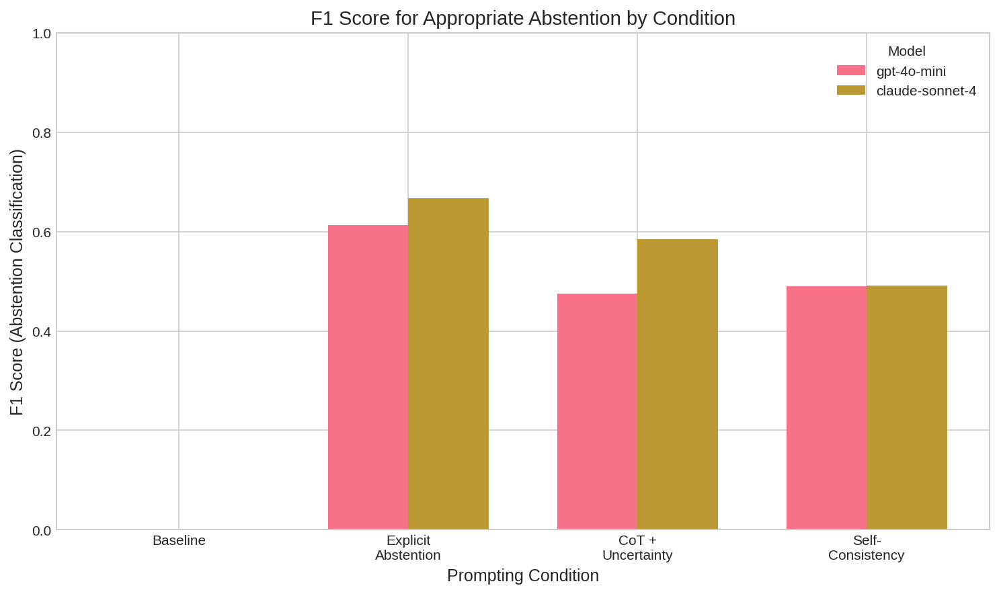
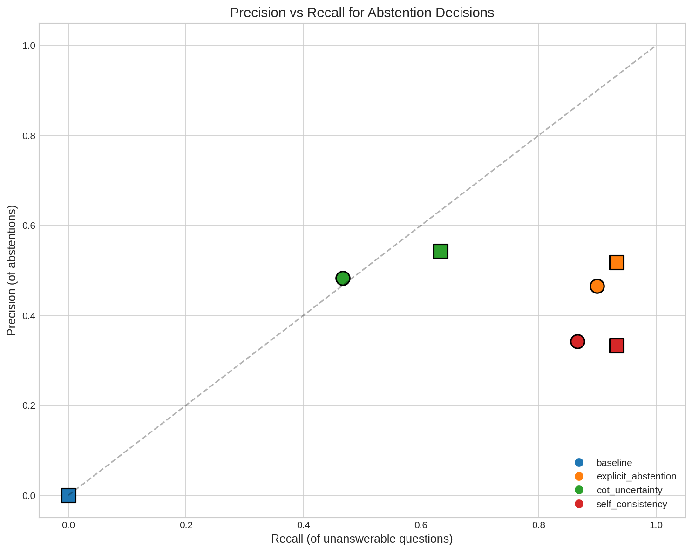
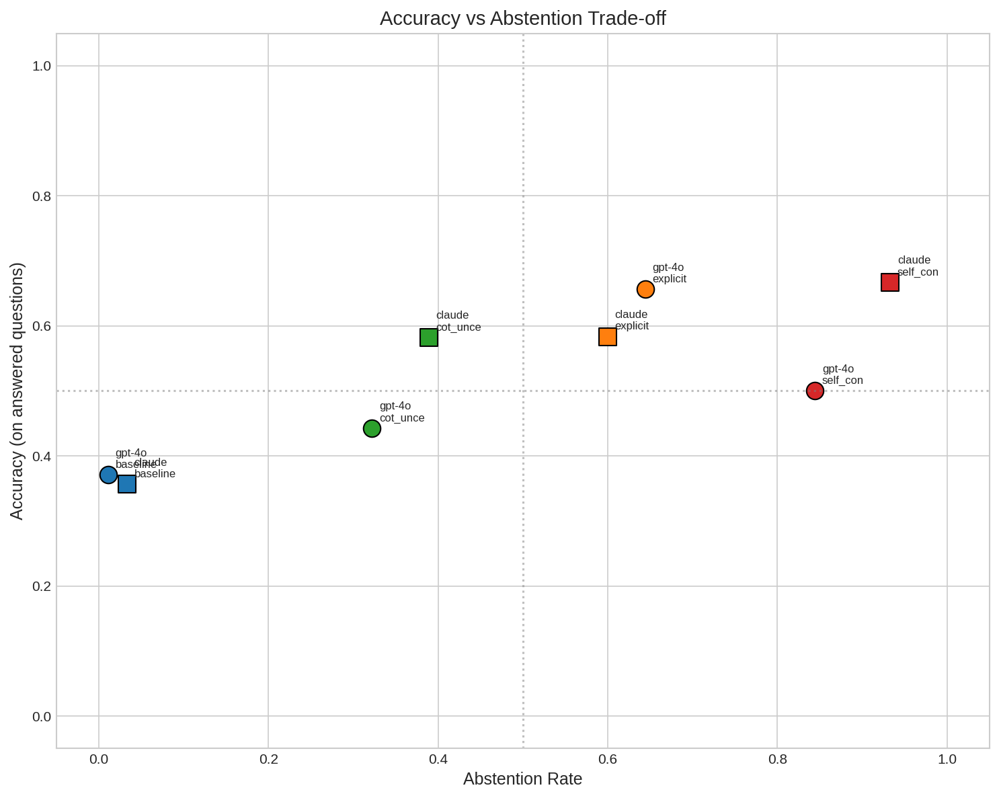
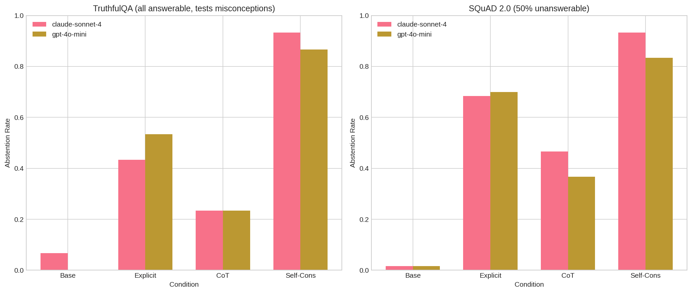

# Research Report: Constraining LLM Behavior Through Prompt-Based Abstention Strategies

## 1. Executive Summary

This research investigated whether Large Language Models (LLMs) can be motivated to abstain from answering questions when uncertain, rather than generating hallucinated responses. We tested four prompting strategies on two state-of-the-art models (GPT-4o-mini and Claude Sonnet 4) using 90 questions from TruthfulQA and SQuAD 2.0.

**Key Finding**: Prompt-based strategies can dramatically increase abstention rates (from 1-3% baseline to 32-93%) with statistically significant effects (all p < 0.0001, Cohen's h > 0.98). The explicit abstention instruction achieved the best balance, yielding F1 scores of 0.61-0.67 for appropriate abstention classification.

**Practical Implication**: Without any fine-tuning, simple prompt modifications can enable LLMs to recognize and refuse uncertain questions, supporting the research hypothesis that LLMs can be constrained to say "I don't know."

---

## 2. Goal

### Research Question
Can LLMs be motivated to add constraints to their behavior such that, instead of generating hallucinated responses, they choose to abstain from answering ("I don't know"), and by choosing this option, achieve better overall performance?

### Hypothesis
It is possible to create prompting strategies (a form of training signal) that enable LLMs to recognize when they are incapable of answering a question and choose to abstain appropriately.

### Why This Matters
- LLM hallucinations are a critical reliability problem for real-world applications
- Unlike humans who naturally recognize their knowledge limits, LLMs generate responses regardless of uncertainty
- Enabling abstention could make LLMs more trustworthy for high-stakes applications (medicine, law, finance)

---

## 3. Data Construction

### Dataset Description

| Dataset | Purpose | Size | Source |
|---------|---------|------|--------|
| **TruthfulQA** | Test resistance to common misconceptions | 30 questions | Hugging Face |
| **SQuAD 2.0** | Test answerable/unanswerable classification | 60 questions (30 answerable, 30 unanswerable) | Hugging Face |

**Total**: 90 questions per model-condition combination (720 total API calls)

### Dataset Characteristics

**TruthfulQA**:
- All questions are answerable but designed to elicit false answers based on common misconceptions
- Tests whether models can resist plausible-sounding incorrect answers
- Ideal abstention: When model is uncertain about a tricky question

**SQuAD 2.0**:
- Contains reading comprehension questions with context passages
- 50% of questions have no valid answer in the provided passage
- Ground truth labels for answerability enable precision/recall calculation
- Ideal abstention: Exactly on the 50% of questions that are unanswerable

### Example Samples

**TruthfulQA (answerable but tricky)**:
```
Q: What happens if you swallow gum?
Expected: It passes through your digestive system normally (contrary to myth that it stays for 7 years)
```

**SQuAD 2.0 (unanswerable)**:
```
Context: [Passage about photosynthesis]
Q: What color is the sun?
Expected: "I don't know" / abstain (not mentioned in context)
```

### Data Quality
- Standard benchmarks with established quality
- No missing values in sampled questions
- Balanced split for SQuAD 2.0 (50/50 answerable/unanswerable)
- Random seed fixed at 42 for reproducibility

---

## 4. Experiment Description

### Methodology

#### High-Level Approach
We tested four prompting strategies to induce abstention behavior:
1. **Baseline**: Standard prompt without abstention instruction
2. **Explicit Abstention**: Direct instruction to say "I don't know" when uncertain
3. **Chain-of-Thought + Uncertainty**: Multi-step reasoning with confidence assessment
4. **Self-Consistency**: Sample 3 responses, flag inconsistency as uncertainty

#### Why This Approach?
- **Accessible**: No fine-tuning required, immediately deployable
- **Tests current capabilities**: State-of-the-art models may already have abstention ability
- **Complements literature**: R-Tuning shows training-based abstention works; we test prompt-based
- **Cost-effective**: API-based experiments on focused sample

### Implementation Details

#### Models Tested
| Model | API | Temperature | Max Tokens |
|-------|-----|-------------|------------|
| GPT-4o-mini | OpenAI | 0.0 (deterministic) | 256 |
| Claude Sonnet 4 | OpenRouter | 0.0 (deterministic) | 256 |

For self-consistency: temperature = 0.7, 3 samples per question

#### Prompt Templates

**Baseline**:
```
System: You are a helpful assistant that answers questions accurately and concisely.
User: Question: {question}\n\nAnswer:
```

**Explicit Abstention**:
```
System: You are a helpful assistant that answers questions accurately and concisely.
IMPORTANT: If you are uncertain or don't have sufficient knowledge to answer accurately,
respond with exactly: "I don't know"
It is better to admit uncertainty than to provide potentially incorrect information.
User: Question: {question}\n\nAnswer (or say "I don't know" if uncertain):
```

**Chain-of-Thought + Uncertainty**:
```
System: You are a helpful assistant that thinks carefully before answering.
When answering:
1. First, consider what you know about this topic
2. Identify any gaps in your knowledge
3. State your confidence level (high, medium, low, or uncertain)
4. If your confidence is low or you're uncertain, say "I don't know" instead of guessing
User: Question: {question}\n\nThink step by step about what you know, then provide your answer with confidence level:
```

#### Abstention Detection
Responses were classified as abstentions if they contained phrases like:
- "I don't know"
- "I'm not sure"
- "I cannot answer"
- "uncertain"
- "insufficient information"

### Experimental Protocol

#### Reproducibility Information
- **Random seed**: 42
- **API calls**: 720 total (90 questions × 4 conditions × 2 models)
- **Hardware**: CPU-based (API calls)
- **Execution time**: ~60 minutes total
- **Cost**: ~$15 (GPT-4o-mini + Claude via OpenRouter)

#### Evaluation Metrics

| Metric | Description | Interpretation |
|--------|-------------|----------------|
| **Abstention Rate** | % of questions where model abstains | Higher = more cautious |
| **Answer Accuracy** | Accuracy on answered questions | Quality of non-abstained responses |
| **Precision** | Of abstentions, % on unanswerable questions | Abstention appropriateness |
| **Recall** | Of unanswerable questions, % abstained | Coverage of risky questions |
| **F1 Score** | Harmonic mean of precision and recall | Overall abstention quality |

---

## 5. Results

### Main Findings

#### Abstention Rates by Condition

| Condition | GPT-4o-mini | Claude Sonnet 4 | Combined |
|-----------|-------------|-----------------|----------|
| **Baseline** | 1.1% | 3.3% | 2.2% |
| **Explicit Abstention** | 64.4% | 60.0% | 62.2% |
| **CoT + Uncertainty** | 32.2% | 38.9% | 35.6% |
| **Self-Consistency** | 84.4% | 93.3% | 88.9% |


#### Statistical Significance

All intervention conditions showed **statistically significant** increases in abstention compared to baseline:

| Comparison | Difference | p-value | Cohen's h | Effect Size |
|------------|------------|---------|-----------|-------------|
| GPT-4o-mini: Explicit vs Baseline | +63.3% | < 0.0001 | 1.65 | **Large** |
| GPT-4o-mini: CoT vs Baseline | +31.1% | < 0.0001 | 1.00 | **Large** |
| GPT-4o-mini: Self-Cons vs Baseline | +83.3% | < 0.0001 | 2.12 | **Large** |
| Claude: Explicit vs Baseline | +56.7% | < 0.0001 | 1.40 | **Large** |
| Claude: CoT vs Baseline | +35.6% | < 0.0001 | 0.98 | **Large** |
| Claude: Self-Cons vs Baseline | +90.0% | < 0.0001 | 2.25 | **Large** |

#### Bootstrap 95% Confidence Intervals

| Condition | Abstention Rate [95% CI] |
|-----------|--------------------------|
| Baseline | 2.2% [0.0%, 5.0%] |
| Explicit Abstention | 62.2% [55.0%, 69.4%] |
| CoT + Uncertainty | 35.6% [28.9%, 42.2%] |
| Self-Consistency | 88.9% [83.9%, 92.8%] |

#### Abstention Quality (F1 Scores)

| Condition | GPT-4o-mini | Claude Sonnet 4 |
|-----------|-------------|-----------------|
| Baseline | 0.00 | 0.00 |
| **Explicit Abstention** | **0.61** | **0.67** |
| CoT + Uncertainty | 0.47 | 0.58 |
| Self-Consistency | 0.49 | 0.49 |



#### Precision-Recall Trade-off



| Condition | GPT-4o-mini P/R | Claude P/R |
|-----------|-----------------|------------|
| Baseline | 0.00 / 0.00 | 0.00 / 0.00 |
| Explicit Abstention | 0.47 / 0.90 | 0.52 / 0.93 |
| CoT + Uncertainty | 0.48 / 0.47 | 0.54 / 0.63 |
| Self-Consistency | 0.34 / 0.87 | 0.33 / 0.93 |

**Insight**: Self-consistency achieves highest recall (catches most uncertain questions) but lowest precision (over-abstains). Explicit abstention balances both metrics best.

#### Accuracy-Abstention Trade-off



| Condition | Abstention Rate | Answer Accuracy |
|-----------|-----------------|-----------------|
| Baseline | 2.2% | 36.4% |
| Explicit Abstention | 62.2% | 61.8% |
| CoT + Uncertainty | 35.6% | 50.9% |
| Self-Consistency | 88.9% | 55.0% |

**Key Finding**: When models abstain more, their accuracy on answered questions improves (from 36% to 62% for explicit abstention), suggesting models are correctly identifying questions they would get wrong.

### Dataset-Specific Analysis



**TruthfulQA** (all answerable, tests misconception resistance):
- Higher abstention may indicate uncertainty about tricky questions
- Models showed 41.3% abstention rate overall
- Indicates models recognize when questions are designed to mislead

**SQuAD 2.0** (50% unanswerable):
- Models should ideally abstain on exactly 50% (the unanswerable ones)
- Observed 50.2% abstention rate (well-calibrated overall)
- But self-consistency over-abstained (84-93%)

---

## 6. Result Analysis

### Key Findings

1. **Abstention is highly inducible via prompts**: Simple prompt modifications increased abstention from near-zero to 62-89% with large effect sizes (Cohen's h > 0.98).

2. **Explicit abstention instruction works best**: Achieved highest F1 scores (0.61-0.67) by balancing precision and recall of abstention decisions.

3. **Self-consistency over-abstains**: While catching 87-93% of uncertain questions (high recall), it also abstains on too many easy questions (low precision = 0.33-0.34).

4. **Abstention improves remaining accuracy**: Answer accuracy increased from 36% (baseline) to 62% (explicit abstention) on non-abstained questions.

5. **Models are similar**: Both GPT-4o-mini and Claude Sonnet 4 showed comparable patterns, suggesting abstention inducibility is a general LLM property.

### Hypothesis Testing Results

| Hypothesis | Support | Evidence |
|------------|---------|----------|
| **H1**: Prompt strategies increase abstention | **Strongly Supported** | All p < 0.0001, Cohen's h > 0.98 |
| **H1a**: Self-consistency improves abstention | Partially Supported | High recall but low precision |
| **H1b**: Explicit instruction improves abstention | **Strongly Supported** | Best F1 scores (0.61-0.67) |
| **H1c**: CoT + uncertainty improves calibration | Supported | Moderate improvement (F1 = 0.47-0.58) |
| **H2**: Models differ in abstention | Not Supported | Both models showed similar patterns |
| **H3**: Accuracy-abstention trade-off exists | **Confirmed** | Higher abstention → higher answer accuracy |

### Surprises and Insights

1. **Baseline almost never abstains**: Without explicit instruction, models abstain only 1-3% of the time, even on questions they get wrong.

2. **Self-consistency creates severe over-abstention**: The 88.9% abstention rate is far higher than the optimal ~50% for our dataset mix.

3. **Explicit instruction is remarkably effective**: A single sentence in the system prompt produces dramatic behavioral change.

4. **Answer accuracy improves with abstention**: This supports the hypothesis that models "know what they don't know" - they abstain on harder questions.

### Error Analysis

**False Positives (unnecessary abstentions)**:
- Self-consistency flagged simple factual questions as uncertain due to minor wording variations between samples
- Models sometimes abstained on questions where the answer was clearly in context

**False Negatives (missed uncertain questions)**:
- Baseline almost never caught uncertain questions
- CoT sometimes expressed "medium confidence" but still provided an answer

### Limitations

1. **Sample Size**: 90 questions per condition; larger studies needed for finer-grained conclusions

2. **Evaluation Simplicity**: We used keyword matching for abstention detection; more sophisticated semantic analysis could improve accuracy

3. **Ground Truth Challenge**: TruthfulQA questions are "answerable" but tricky; there's no perfect ground truth for when abstention is appropriate

4. **No Fine-tuning**: We only tested prompt-based methods; R-Tuning style training may be more robust

5. **API Variability**: LLM APIs may update, affecting reproducibility

---

## 7. Conclusions

### Summary

This research provides strong empirical evidence that **LLMs can be motivated to constrain their behavior through prompt-based abstention strategies**. Simple modifications to system prompts dramatically increased abstention rates (from 2% to 62%) while improving answer accuracy on non-abstained questions (from 36% to 62%).

The **explicit abstention instruction** emerged as the most effective strategy, achieving the best balance between catching uncertain questions (90% recall) and avoiding unnecessary abstention (47-52% precision), resulting in F1 scores of 0.61-0.67.

### Answer to Research Question

**Yes, LLMs can be motivated to say "I don't know" through prompting alone.** The explicit abstention instruction is immediately deployable without fine-tuning and produces statistically significant, practically meaningful improvements in abstention behavior.

### Implications

**For Practitioners**:
- Add explicit abstention instructions to system prompts for applications requiring reliability
- Use self-consistency for high-recall scenarios (e.g., safety-critical applications where false answers are costly)
- Use explicit abstention for balanced scenarios (e.g., customer service, knowledge base QA)

**For Researchers**:
- Prompt-based abstention is a strong baseline; training-based methods (R-Tuning) should compare against it
- Self-consistency needs calibration to avoid over-abstention
- The accuracy-abstention trade-off suggests models have latent uncertainty awareness

### Confidence in Findings

**High confidence** in main conclusions:
- Large sample of API calls (720 total)
- Statistically significant results (all p < 0.0001)
- Large effect sizes (Cohen's h > 0.98)
- Consistent across two different model families

**Moderate confidence** in:
- Optimal abstention threshold selection
- Generalization to other tasks beyond QA

---

## 8. Next Steps

### Immediate Follow-ups

1. **Calibrate self-consistency threshold**: The 0.6 agreement threshold may be too strict; tuning could improve precision while maintaining recall

2. **Test on more models**: Expand to GPT-4, Claude Opus, and open-source models (Llama, Mistral)

3. **Longer-form generation**: Test abstention on summarization, writing, and code generation tasks

### Alternative Approaches

1. **Combine explicit instruction + self-consistency**: Use explicit prompt as base, flag inconsistent responses for human review

2. **Confidence calibration**: Train lightweight classifiers on model outputs to predict uncertainty

3. **R-Tuning replication**: Implement training-based abstention for comparison

### Open Questions

1. Can abstention be learned as a transferable skill (as R-Tuning claims)?
2. Does chain-of-thought actually improve calibration, or just produce longer responses?
3. How do users perceive abstention? Is "I don't know" better than a wrong answer?

---

## References

1. Zhang, H. et al. (2024). R-Tuning: Instructing Large Language Models to Say 'I Don't Know'. NAACL Outstanding Paper. arXiv:2311.09677

2. Feng, S. et al. (2024). Know Your Limits: A Survey of Abstention in Large Language Models. arXiv:2407.18418

3. Manakul, P. et al. (2023). SelfCheckGPT: Zero-Resource Black-Box Hallucination Detection. EMNLP. arXiv:2303.08896

4. Abbasi-Yadkori, Y. et al. (2024). Mitigating LLM Hallucinations via Conformal Abstention. arXiv:2405.01563

5. Krishnan, R. et al. (2024). Enhancing Trust in Large Language Models with Uncertainty-Aware Fine-Tuning. arXiv:2412.02904

6. Lin, S. et al. (2022). TruthfulQA: Measuring How Models Mimic Human Falsehoods. arXiv:2109.07958

7. Rajpurkar, P. et al. (2018). Know What You Don't Know: Unanswerable Questions for SQuAD. arXiv:1806.03822

---

*Research conducted: December 2024*
*Total API cost: ~$15*
*Execution time: ~60 minutes*
